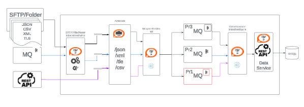
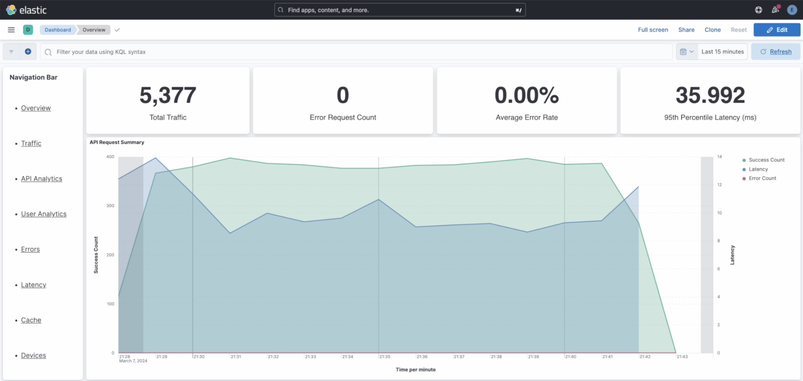

# Message Router
Efficiency and Performance Evaluation of Message Consumption and Storage Solutions using Kafka Message Queues

# Arhitecture diagram 
This project aims to address the challenge of parsing messages from diverse sources across controlled gateways, routing them based on internal logic, and storing them in Kafka queues. The idea is to develop solutions using Integration Studio and Ballerina, facilitating faster application development and streamlining the CI/CD pipeline while evaluating their performance. Through this comparative study, we seek to identify the most effective approach for meeting the requirements of message handling and processing in a distributed environment.

# Solution build in Integration Studio (MI)

The solution is divided into two projects:

SpaceTR Solution: There are component that can be identified as:
 - monitoring file drops in local folders and SFTP locations and after parsing files sending messages one by one to the APIM Gateway, 
 - REST API acting as endpoints for APIM Gateway, 
 - inbound endpoints to consume messages from topics and forward them to DataService.

SpaceDS: This is a data service designed to receive messages and store them in a MySQL database.

The Observation point is identified as a critical part of the system and requires monitoring. Any failures in this area could lead to system instability and result in the loss of messages. The key monitoring areas include:

SFTP/Folder inbound endpoints
APIM Gateway
Message router API
Kafka message queues
Kafka consumer endpoint
DataService
MySQL Database

ELK analitics was connect to APIM GW and performaces recordeing during prasing the ~6MB file with ~5000 JSON message is presented here (>35ms per message)

# Ballerina solution (ballerina)

Solution 

